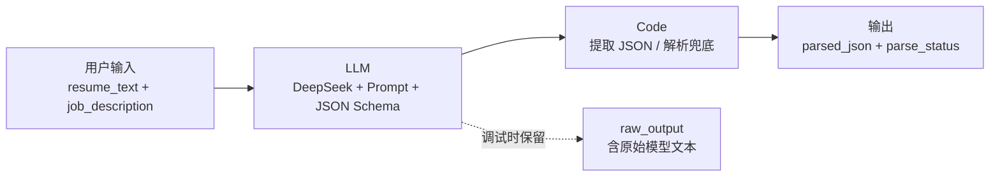

# AI 简历初筛与岗位匹配助手

一个以 **Dify + DeepSeek + Code 节点 + Excel** 实现的 AI 应用落地作品。它将简历文本和岗位 JD 转为可解释、可人工复核的结构化结果；AI 只辅助整理与提示，最终录用决策始终由人做出。

## 项目背景

招聘初筛通常需要反复阅读简历、比对岗位要求、记录待确认项。本项目将这类重复工作拆为可配置工作流：提取匹配证据、按公开评分规则计算分数、标记信息缺失，并生成面试追问建议。

## 工作流架构

| 节点 | 设计意图 |
|---|---|
| 用户输入 | 输入候选人简历与当前岗位 JD。 |
| LLM | 按技能 40%、相关经验 25%、项目相关性 20%、综合质量 15% 输出带证据的候选人分析。 |
| Code | 清理模型可能出现的代码围栏或 `<think>` 内容，解析 JSON；失败时返回 `parse_failed`，避免工作流崩溃。 |
| 输出 | 对外仅返回 `parsed_json` 与 `parse_status`；`raw_output` 仅用于调试。 |

## 核心设计

- **证据追溯**：评分必须附带简历原文依据。
- **信息不足不推断**：缺少信息时输出 `supplement` 或待确认项，而不是自动淘汰。
- **人工复核优先**：招聘是高影响场景，系统不做自动录用或淘汰决定。
- **JSON 容错**：Code 节点在模型未完全遵循格式时保留原文并返回可诊断状态。

## 已验证测试

| 样例 | 分数 | 推荐 | JSON 解析 | 验收 |
|---|---:|---|---|---|
| AI 项目匹配但工作流实操待确认 | 72 | `manual_review` | `success` | PASS |
| 信息缺失候选人 | 2 | `supplement` | `success` | PASS |

详见 [测试记录](docs/test_report.md) 与 [测试结果 CSV](docs/test_results.csv)。剩余 3 份样例与边界测试应在 Dify 中继续执行；未运行项不会计为通过。

## Dify 配置要点

1. 开始节点创建必填文本变量 `resume_text` 和 `job_description`。
2. 在 LLM 节点粘贴 [System Prompt](docs/dify/system_prompt.md)。
3. **通过 Dify 变量选择器**插入两个输入变量，不要手写节点路径。
4. 在 Code 节点将 LLM 的 `text` 映射到 `llm_output`，粘贴 [JSON 容错代码](docs/dify/code_node.py)。
5. 输出节点保留 Code 节点的 `parsed_json`、`parse_status`；调试时可附带 `raw_output`，不要直接返回 LLM 的 `text`。

## 项目文件

- [Prompt 与 Code 配置](docs/dify/)
- [脱敏测试样例](docs/test_cases/)
- [预期结果与实际测试记录](docs/expected_results.csv)
- [Excel 人工复核模板](outputs/candidate_review_template.xlsx)
- [Demo 讲稿](docs/demo_script.md)
- [面试问答](docs/interview_qa.md)

## 复现与边界

所有测试简历均为虚构脱敏样例。系统仅使用简历中明确提供的业务相关信息；不索取或评价年龄、性别、籍贯、婚育、民族、健康等敏感个人信息。
