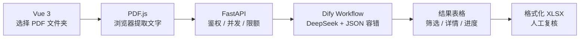

# AI 简历批量评估工作台

一个使用 **Vue 3、FastAPI、Dify Workflow 与 DeepSeek** 构建的 AI
应用作品。浏览器批量读取本地 PDF 简历，后端安全调用 Dify，页面展示可解释的
岗位匹配结果，并导出适合人工复核的格式化 Excel。

> 在线演示：[https://43-132-155-30.sslip.io](https://43-132-155-30.sslip.io)
>
> 当前为受限作品集服务，需要访问口令。该临时域名会在自有域名启用后替换。

## 项目能力

- 选择文件夹或多个 PDF，浏览器端使用 PDF.js 提取文字，原始文件不会上传至后端。
- 填写岗位 JD，并可追加受控的补充评价要求。
- FastAPI 隐藏 Dify API Key，控制并发、任务归属、超时、重试和每日调用额度。
- Dify Workflow 根据明确评分规则输出结构化 JSON；Code 节点处理代码围栏、
  `<think>` 内容和解析失败兜底。
- 页面实时显示批次进度，支持结果筛选、排序、详情查看和任务取消。
- 下载带筛选、条件格式、动态行高、人工复核下拉框和处理说明的 XLSX。
- 信息不足时标记为补充材料或人工复核，不由 AI 自动决定录用或淘汰。

## 架构



评分维度默认为技能匹配 40%、相关经验 25%、项目相关性 20%、综合质量 15%。
评分必须附带简历证据；缺少信息时不得自行推断。

## 使用在线演示

1. 打开在线演示地址并输入访问口令。
2. 选择简历文件夹，或一次选择多个 PDF。
3. 填写岗位 JD；补充评价要求为选填项。
4. 点击“批量评估”，查看逐份状态和总体进度。
5. 在结果表中筛选、排序或展开详情。
6. 下载 Excel，完成人工复核与最终判断。

在线服务的默认边界：

- 单个批次最多 10 份简历。
- 单个 IP 每天最多评估 10 份，全站每天最多评估 50 份，按北京时间重置。
- 单个 PDF 最大 10 MB、30 页，提取文本最大 60,000 字符。
- 并发数默认为 3；网络错误、超时、429 和服务端错误最多自动重试两次。
- 任务和结果保存在进程内存中，服务重启后不会恢复；每日额度保存在 SQLite 中。

## 本地开发

### 1. 后端

```powershell
cd web/backend
python -m venv .venv
.\.venv\Scripts\python.exe -m pip install -r requirements.txt
Copy-Item .env.example .env
```

编辑 `web/backend/.env`：

```dotenv
ENVIRONMENT=development
DIFY_BASE_URL=https://api.dify.ai/v1
DIFY_API_KEY=app-your-real-key
DIFY_CONCURRENCY=3
DIFY_TIMEOUT_SECONDS=120
TASK_TTL_SECONDS=7200

# 本地开发可留空；公网生产环境必须至少 12 个字符。
APP_ACCESS_CODE=
# 公网生产环境必须使用至少 32 个随机字符。
SESSION_SECRET=
SESSION_COOKIE_SECURE=false

PER_IP_DAILY_RESUME_LIMIT=10
GLOBAL_DAILY_RESUME_LIMIT=50
QUOTA_TIMEZONE=Asia/Shanghai
QUOTA_DB_PATH=
TRUST_PROXY_HEADERS=false
```

API Key 必须来自已发布的 Dify Workflow 应用。不要把 `.env`、API Key 或访问
口令提交到 Git。

### 2. 前端

```powershell
cd web/frontend
pnpm install
pnpm run build
```

### 3. 启动

完成前端构建后，在仓库根目录执行：

```powershell
.\web\start.ps1
```

访问 <http://127.0.0.1:8000>。

开发时也可以分别启动：

```powershell
# 终端一：web/backend
.\.venv\Scripts\python.exe -m uvicorn app.main:app --reload

# 终端二：web/frontend
pnpm run dev
```

Vite 开发地址为 <http://127.0.0.1:5173>，`/api` 会代理到 FastAPI。

## Dify Workflow

推荐直接导入 [`workflow/简历分析助手.yml`](workflow/简历分析助手.yml)，检查模型
凭据后发布。工作流输入为：

| 字段 | 必填 | 说明 |
|---|---|---|
| `resume_text` | 是 | 浏览器从单份 PDF 提取的简历文本 |
| `job_description` | 是 | 岗位 JD |
| `custom_instructions` | 否 | 只能补充业务关注点，不替代评分和安全规则 |

可单独查看和维护：

- [`docs/dify/system_prompt.md`](docs/dify/system_prompt.md)
- [`docs/dify/user_prompt.txt`](docs/dify/user_prompt.txt)
- [`docs/dify/code_node.py`](docs/dify/code_node.py)

后端优先读取 Dify 的 `parsed_json`，同时兼容 `result` 和展开输出字段。

## 腾讯云部署

当前生产环境为腾讯云香港轻量应用服务器，使用一个 Docker Compose 项目运行：

- `app`：构建 Vue 静态资源并启动 FastAPI。
- `caddy`：反向代理、HTTP 自动跳转 HTTPS、自动申请和续期证书。
- `quota_data`：持久化每日限额 SQLite 数据库。

部署配置位于 [`deploy/tencent/`](deploy/tencent/README.md)。服务器需要开放 TCP
80、TCP 443 和 UDP 443；Dify API Key、访问口令和会话密钥只保存在服务器
`.env` 中。

更新服务：

```bash
cd ~/ai-resume-screening
git pull --ff-only
cd deploy/tencent
sudo docker compose up -d --build
sudo docker compose ps
```

## 测试

后端：

```powershell
cd web/backend
.\.venv\Scripts\python.exe -m pytest -q
```

前端：

```powershell
cd web/frontend
pnpm run build
```

仓库提供虚构脱敏测试案例、预期结果和测试记录：

- [`docs/test_cases/`](docs/test_cases/)
- [`docs/expected_results.csv`](docs/expected_results.csv)
- [`docs/test_results.csv`](docs/test_results.csv)
- [`docs/test_report.md`](docs/test_report.md)

## 项目结构

```text
├── Dockerfile                    # 前端构建 + FastAPI 生产镜像
├── README.md
├── deploy/tencent/               # Compose、Caddy 与腾讯云部署说明
├── docs/
│   ├── dify/                     # Prompt 与 Code 节点源码
│   ├── test_cases/               # 虚构脱敏测试案例
│   ├── demo_script.md            # 3 分钟演示讲稿
│   └── test_report.md            # 测试记录
├── web/
│   ├── backend/                  # FastAPI、Dify 客户端、限额与 XLSX 导出
│   ├── frontend/                 # Vue 3、PDF.js 与结果工作台
│   └── start.ps1                 # Windows 本地启动脚本
└── workflow/
    └── 简历分析助手.yml          # 可直接导入的 Dify Workflow DSL
```

## 隐私与使用边界

- 原始 PDF 仅在浏览器解析；提取后的文本会发送至本项目后端、Dify 和所配置的模型
  服务。
- 公开演示仅应使用虚构、脱敏或已获得授权的简历，不要上传无授权的真实候选人资料。
- 系统不索取或评价年龄、性别、籍贯、婚育、民族、健康等敏感个人信息。
- AI 输出只用于整理和人工复核，不能作为自动录用或淘汰的唯一依据。
