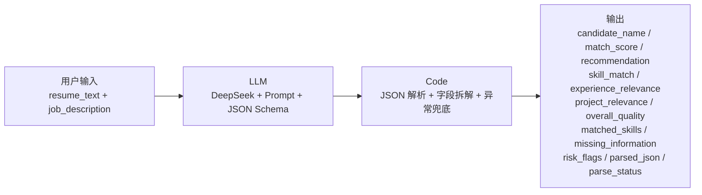

# AI 简历初筛与岗位匹配助手

一个以 **Dify + DeepSeek + Code 节点 + Excel** 实现的 AI 应用落地作品。它将简历文本和岗位 JD 转为可解释、可人工复核的结构化结果；AI 只辅助整理与提示，最终录用决策始终由人做出。

> GitHub: [hllwld/ai-resume-screening](https://github.com/hllwld/ai-resume-screening)

## 项目背景

招聘初筛通常需要反复阅读简历、比对岗位要求、记录待确认项。本项目将这类重复工作拆为可配置工作流：提取匹配证据、按公开评分规则计算分数、标记信息缺失，并生成面试追问建议。

## 工作流架构



| 节点 | 设计意图 |
|---|---|
| 用户输入 | 输入候选人简历与当前岗位 JD。 |
| LLM | 按技能 40%、相关经验 25%、项目相关性 20%、综合质量 15% 输出带证据的候选人分析。 |
| Code | 清理模型可能出现的代码围栏或 `<think>` 内容；解析 JSON；将嵌套字段拆解为独立输出变量；失败时返回 `parse_failed`，避免工作流崩溃。 |
| 输出 | 输出 12 个独立变量（10 个业务字段 + parsed_json + parse_status），批量下载后每个字段独立成列，无需手动解析 JSON。 |

## 核心设计

- **证据追溯**：评分必须附带简历原文依据。
- **信息不足不推断**：缺少信息时输出 `supplement` 或待确认项，而不是自动淘汰。
- **人工复核优先**：招聘是高影响场景，系统不做自动录用或淘汰决定。
- **JSON 容错**：Code 节点在模型未完全遵循格式时保留原文并返回可诊断状态。
- **字段拆解输出**：Code 节点将 LLM 的嵌套 JSON 拆为 `candidate_name`、`match_score`、`recommendation`、四项维度分、`matched_skills`、`missing_information`、`risk_flags` 等独立变量，End 节点直接暴露给外部。

## 批量运行与验收流程

```
1. 将 template.csv 上传到 Dify「批量运行」
2. 跑完后点右上角「下载」
3. 本地运行后处理脚本：
   python flatten_batch_output.py 下载的.csv
4. 打开 local/ 下生成的格式化 xlsx，对照人工复核
```

Dify 批量下载默认为三列（输入 + "生成结果"），`flatten_batch_output.py` 会将 JSON 展开为独立列并输出格式化的 Excel（含颜色渐变、下拉选项、冻结窗格），对齐人工复核模板。输出文件保存在 `local/` 目录，该目录已加入 `.gitignore` 不会提交到仓库。

## 已验证测试

| 样例 | 分数 | 推荐 | JSON 解析 | 验收 |
|---|---:|---|---|---|
| 01 陈晨 — AI 项目匹配但工作流实操待确认 | 73 | `manual_review` | `success` | PASS |
| 02 候选人A — 信息缺失 | 21 | `supplement` | `success` | PASS |
| 03 林晓 — 技能匹配但经验不足 | 39 | `manual_review` | `success` | PASS |
| 04 周宁 — 跨行业转行 | 58 | `manual_review` | `success` | PASS |
| 05 格式混乱 — 信息极度简略 | 12 | `supplement` | `success` | PASS |

详见 [测试记录](docs/test_report.md) 与 [测试结果 CSV](docs/test_results.csv)。

## Dify 配置要点

1. 开始节点创建必填文本变量 `resume_text` 和 `job_description`。
2. 在 LLM 节点粘贴 [System Prompt](docs/dify/system_prompt.md)，模型选择 DeepSeek。
3. **通过 Dify 变量选择器**插入两个输入变量，不要手写节点路径。
4. 在 Code 节点将 LLM 的 `text` 映射到 `llm_output`，粘贴 [JSON 容错代码](docs/dify/code_node.py)。
5. **导入 DSL**：可直接导入 [`workflow/简历分析助手.yml`](workflow/简历分析助手.yml) 快速创建完整工作流。
6. End 节点输出 12 个独立变量，不再暴露 LLM 原始文本。

## 项目文件

```
├── README.md
├── DELIVERY_MANIFEST.md              # 交付清单
├── flatten_batch_output.py          # 批量下载后处理：CSV → 格式化 xlsx
├── build_excel_template.mjs         # 生成人工复核模板 Excel
├── build_test_results.mjs           # 生成验收表 Excel
├── widen_templates.mjs              # Excel 列宽调整
├── .gitignore
├── local/                           # 本地输出目录（已 gitignore）
├── docs/
│   ├── dify/
│   │   ├── system_prompt.md         # LLM System Prompt
│   │   ├── user_prompt.txt          # User Prompt 模板
│   │   ├── code_node.py             # JSON 容错 + 字段拆解代码
│   │   └── report_template.md       # 报告模板
│   ├── test_cases/                  # 5 份脱敏测试简历 + JD + 批量模板
│   │   ├── 01_high_match.md
│   │   ├── 02_missing_info.md
│   │   ├── 03_skill_but_junior.md
│   │   ├── 04_career_switcher.md
│   │   ├── 05_messy_format.md
│   │   ├── job_description.txt
│   │   └── template.csv             # Dify 批量导入 + 验收记录一体化模板
│   ├── expected_results.csv         # 预期结果
│   ├── test_results.csv             # 实际测试记录
│   └── test_report.md               # 测试验收说明
├── workflow/
│   └── 简历分析助手.yml             # Dify Workflow DSL（可直接导入）
└── outputs/
    ├── test_acceptance.xlsx         # 验收 Excel
    ├── candidate_review_template.xlsx  # 人工复核空模板
    └── *_preview.png                # Excel 预览截图
```

## 复现与边界

所有测试简历均为虚构脱敏样例。系统仅使用简历中明确提供的业务相关信息；不索取或评价年龄、性别、籍贯、婚育、民族、健康等敏感个人信息。
